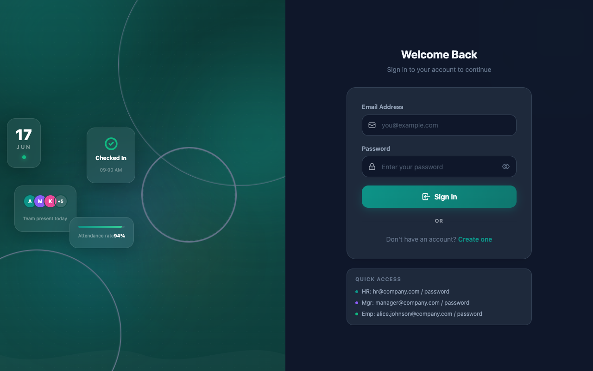
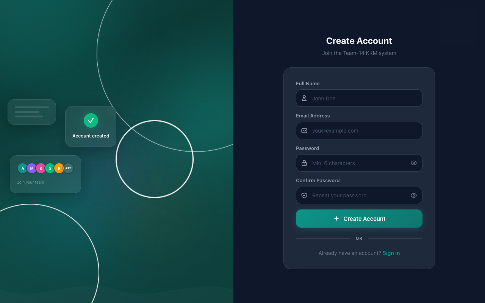
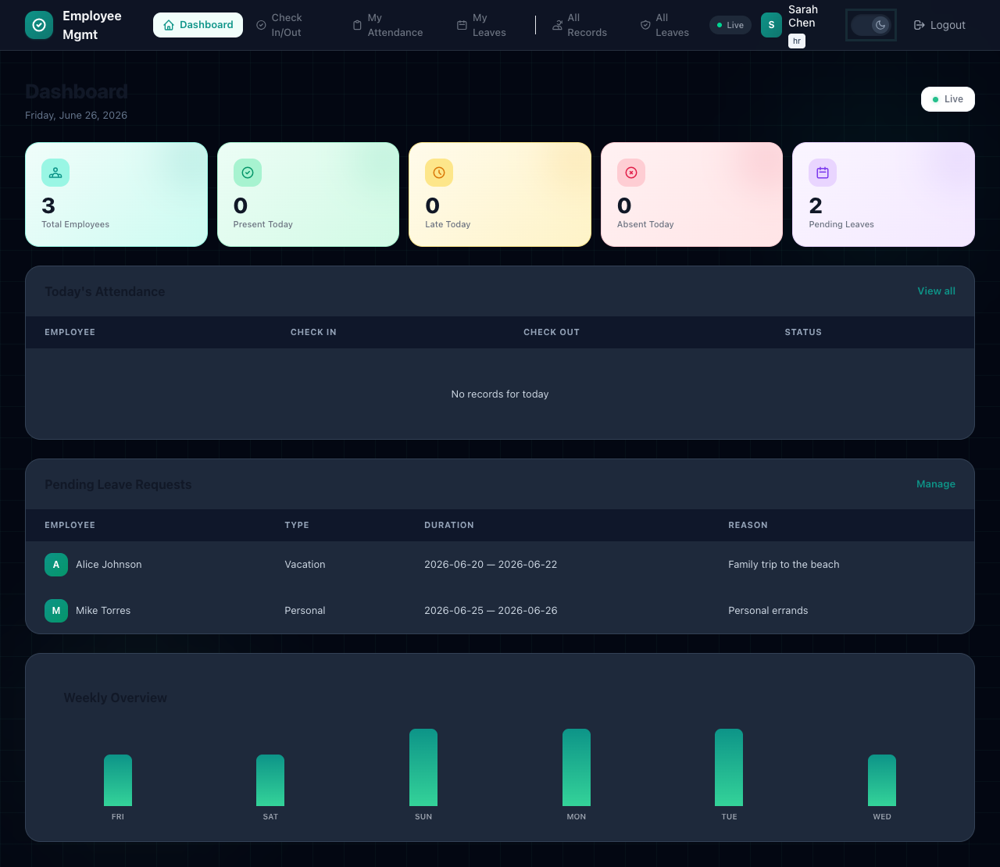
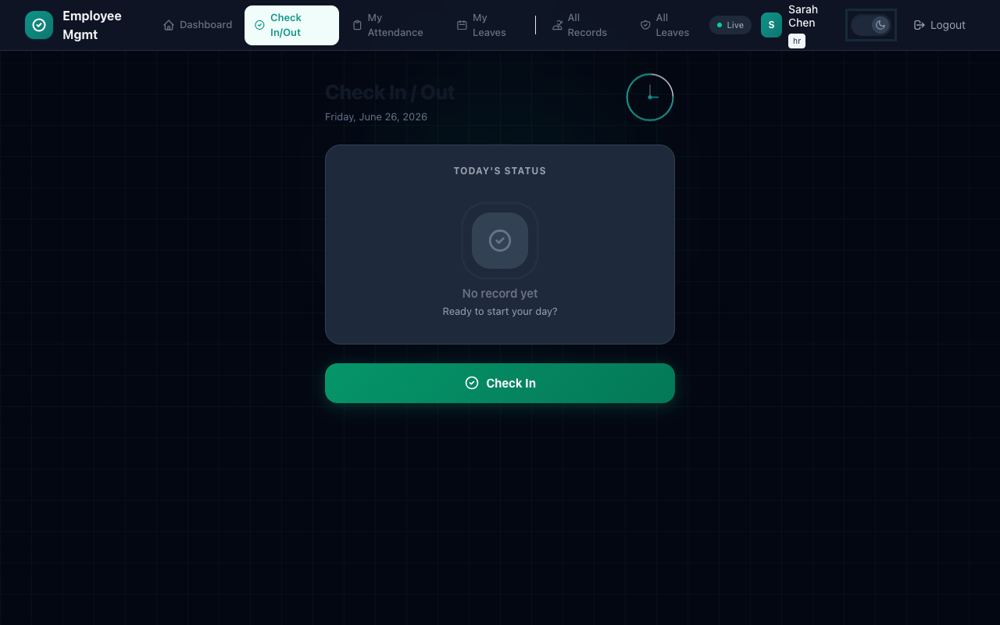
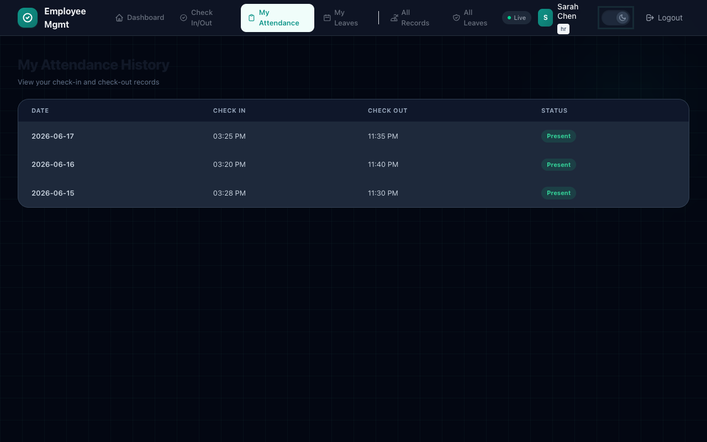
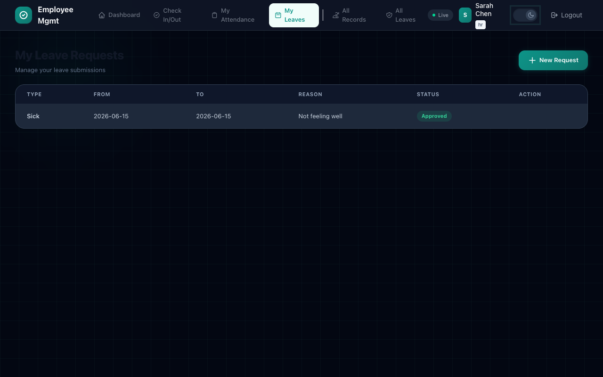
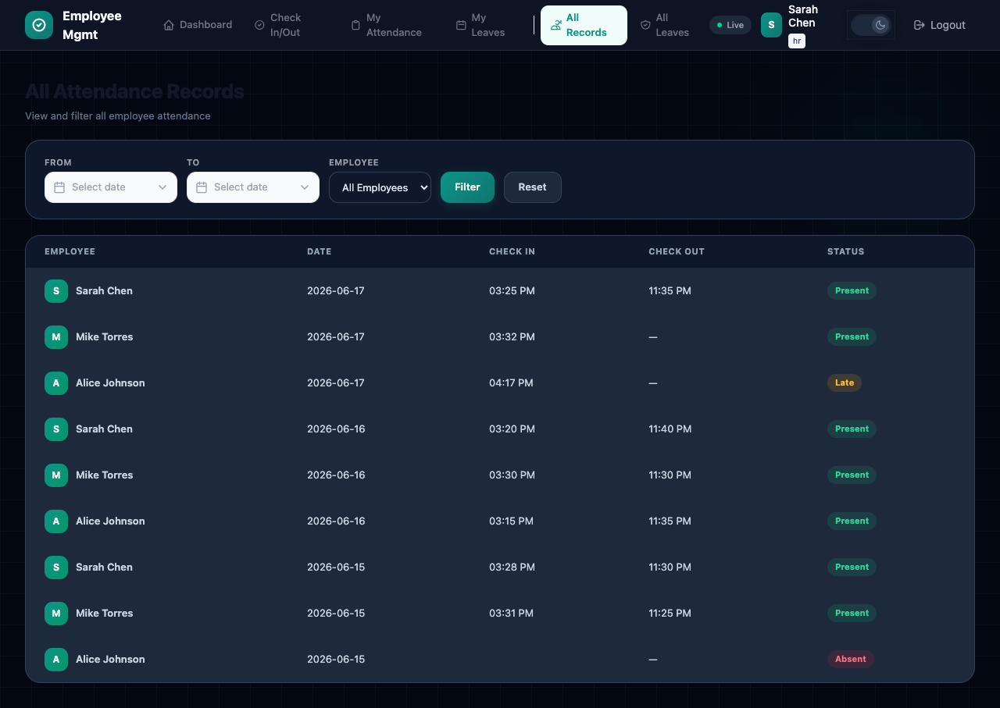
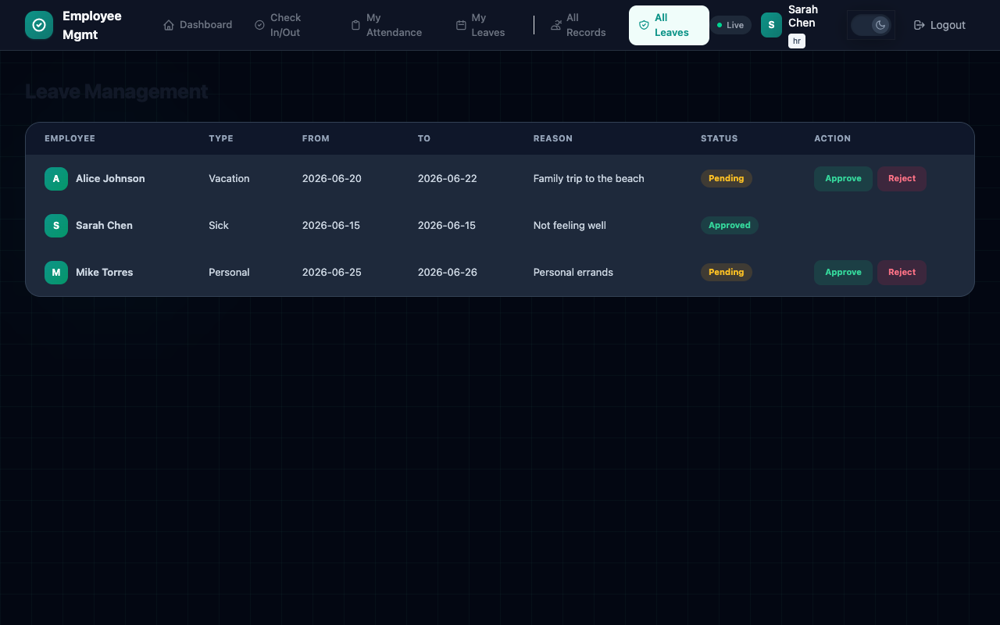

<p align="center">
  <h1 align="center">Attendance & Leave Management</h1>
  <p align="center">A lightweight employee attendance and leave-management web application built with Laravel + Vue 3.</p>
</p>

---

## Overview

An API-driven system for managing employee attendance (check-in/check-out, late detection) and leave requests with an approval workflow. Role-based dashboards serve HR, managers, and employees.

- **Backend:** PHP 8.3, Laravel 13, Sanctum API tokens, SQLite (local dev)
- **Frontend:** Vue 3 SPA, Vue Router, Tailwind CSS v4, Vite
- **Live Demo Backend:** In-memory mock API (`mock.js`) — no server required
- **Deploy:** Cloudflare Pages via Wrangler
- **Live Demo:** [https://attendance-8eb.pages.dev](https://attendance-8eb.pages.dev)

## Screenshots

### Login


### Register


### Dashboard (HR view)


### Check In / Out


### My Attendance


### My Leaves


### All Records


### All Leaves


## Key Features

- **Role-based access** — hr, manager, employee roles with scoped views
- **Attendance tracking** — check-in/check-out with automatic late detection
- **Leave management** — submit, approve, and reject leave requests
- **Dashboards** — role-specific summaries (pending approvals, team attendance, personal stats)
- **API-first** — all features exposed via REST API consumed by the SPA frontend

## Quick Start

### 1. Clone & install

```bash
git clone https://github.com/kaykhaingmyint6170/attendance_management
cd attendance_management
composer install
cp .env.example .env
php artisan key:generate
npm install
```

### 2. Database

```bash
touch database/database.sqlite
php artisan migrate --seed
```

### 3. Run dev server

```bash
composer run dev
```

The app will be available at `http://localhost:8000`.

### Demo Credentials (from seeder)

| Role     | Email                       | Password   |
|----------|-----------------------------|------------|
| HR       | hr@team14.com               | password   |
| Manager  | manager@team14.com          | password   |
| Employee | alice.johnson@team14.com    | password   |

## API Routes

| Method   | Endpoint                    | Access       | Description              |
|----------|-----------------------------|--------------|--------------------------|
| POST     | `/api/register`             | Public       | Register new user        |
| POST     | `/api/login`                | Public       | Login, get token         |
| GET      | `/api/user`                 | Authenticated| Current user info        |
| POST     | `/api/logout`               | Authenticated| Logout                   |
| GET      | `/api/dashboard`            | Authenticated| Role-based dashboard     |
| GET      | `/api/attendance`           | Authenticated| All attendance records   |
| GET      | `/api/attendance/my`        | Authenticated| Own attendance records   |
| GET      | `/api/attendance/today`     | Authenticated| Today's status           |
| POST     | `/api/attendance/check-in`  | Authenticated| Clock in                 |
| POST     | `/api/attendance/check-out` | Authenticated| Clock out                |
| GET      | `/api/leave-requests`       | Authenticated| All leave requests       |
| GET      | `/api/leave-requests/my`    | Authenticated| Own leave requests       |
| POST     | `/api/leave-requests`       | Authenticated| Create leave request     |
| PUT      | `/api/leave-requests/{id}`  | Authenticated| Approve/reject (HR/Mgr)  |
| DELETE   | `/api/leave-requests/{id}`  | Authenticated| Delete leave request     |
| GET      | `/api/users`                | HR/Manager   | List all users           |
| PUT      | `/api/users/{id}/role`      | HR/Manager   | Update user role         |

## Deploy

```bash
npm run deploy
```

Assets are built to `public/build` and deployed to Cloudflare Pages via Wrangler (`wrangler.jsonc`).

## Project Structure

```
├── app/
│   ├── Http/Controllers/Api/   # Auth, Attendance, Dashboard, LeaveRequest, User
│   └── Models/                 # User, AttendanceRecord, LeaveRequest
├── database/
│   └── migrations/             # Schema (unique constraint on user+date attendance)
├── resources/
│   ├── js/                     # Vue 3 SPA (pages, components, router, mock API)
│   └── views/                  # Blade entry point
├── routes/
│   ├── api.php                 # REST API routes
│   └── web.php                 # Catch-all for SPA
├── docs/                       # Developer guide & project presentation
├── slides/                     # PechaKucha presentation
├── tools/                      # Screenshot & theme scripts
└── wrangler.jsonc              # Cloudflare Pages config
```

## Commands

```bash
composer run dev          # Coordinated dev (Laravel + queue + Vite)
composer test             # Run PHPUnit tests
php artisan migrate:fresh --seed   # Reset DB and reseed demo data
npm run build             # Production build
npm run deploy            # Build + deploy to Cloudflare
```

## License

MIT
